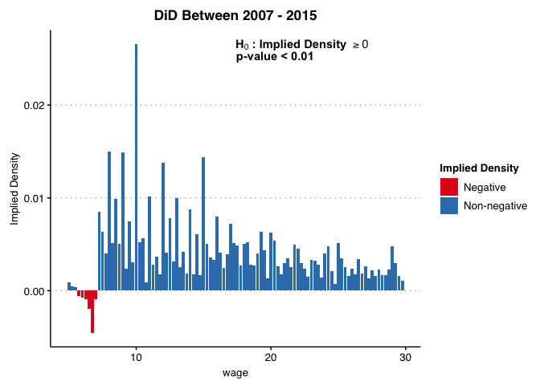
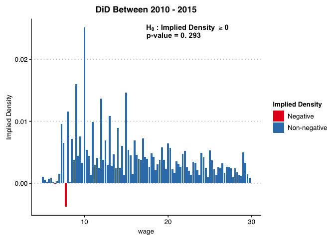

<!-- README.md is generated from README.Rmd. Please edit that file -->

# didFF

<!-- badges: start -->
<!-- badges: end -->

The didFF R package assesses when the validity of
difference-in-differences and related estimators depends on functional
form, based on the theoretical results in [Roth and Sant’Anna
(2022)](https://jonathandroth.github.io/assets/files/2010.04814.pdf).
This package provides a test for whether parallel trends is insensitive
to functional form by estimating the implied density of potential
outcomes under the null and checking if it is significantly below zero
at some point.

## Installation

You can install the development version of didFF from
[GitHub](https://github.com/) with:

``` r
#Install the devtools package if not already installed
# install.packages("devtools")

#Install the didFF package using devtools
devtools::install_github("amenabrown/didFF")
```

## Example

We now provide and example of how to use the package using the empirical
illustration from [Roth and Sant’Anna (2022,
p.11)](https://jonathandroth.github.io/assets/files/2010.04814.pdf).

## Loading the package and the data

We first load the package and the data.

``` r
library(didFF) #load the TestFunctional Form package
mw_df<-didFF::mw_df #load Cengiz et al. (2019) data frame
```

The data is derived from the dataset compiled by [Cengiz et
al. (2019)](https://doi.org/10.1093/qje/qjz014). For each state and
year, it provides the number of people employed at each wage level
(coarsened to 25c bins), with a value of 0 for people not in the labor
force. It also contains an indicator variables (treated) for whether a
state raised its minimum wage in the given year.

``` r
head(mw_df, 5)
#>   statenum year wage treated          pop
#> 1        1 1979 0.00       0 1463246.6238
#> 2        1 1979 1.00       0       0.0000
#> 3        1 1979 1.25       0     415.0158
#> 4        1 1979 1.50       0     777.4267
#> 5        1 1979 1.75       0       0.0000
```

## Testing Functional Form for DiD between 2007 and 2015

We will now test whether a DiD analysis for the effect of the minimum
wage on wages (weighted by population) is insensitive to functional form
– i.e. that parallel trends is valid regardless of whether wages are
measured in levels, logs, percentiles, etc. We first consider an
analysis where the pre-treatment period is 2007, the post-treatment
period is 2015, and the treatment is whether a state raised its minimum
wage at any point between the pre-treatment and post-treatment periods.
(By default, didFF considers a unit to be treated in a given window if
it is treated at any point between the provided start and end years.) We
call didFF as follows:

``` r
didFF(
  DF=mw_df,
  idvar="statenum", #panel id is state 
  yvar="wage",  #outcome is wage
  tvar="year", #time period is year
  treatmentvar = "treated", #treatment indicator
  weight = "pop", #weight by population in each bin
  start_t=2007, #pre-treatment year 
  end_t=2015,  #post-treatment year
  minbin=5, 
  maxbin=29.99
)
#> Warning in is.na(x): is.na() applied to non-(list or vector) of type
#> 'expression'

#> Warning in is.na(x): is.na() applied to non-(list or vector) of type
#> 'expression'
```



The plot shows the implied counterfactual density for the treated group
if parallel trends holds for all functional forms of the outcome, which
Roth and Sant’Anna show is equivalent to “parallel trends of
distributions”. (To preserve reasonable scaling, we use the options
minbin and maxbin so that the plot shows only wages above 5 and below
30). The figure shows that the implied density is negative for wages
between approximately $5-7/hour.

The plot also shows a formal p-value for the null hypothesis that
parallel trends holds for all functional forms (this is calculated using
a “least-favorable” critical value for moment inequalities, as in, e.g.,
Section 4.1.1 of [Canay and Shaikh
(2017)](https://www.econstor.eu/bitstream/10419/130095/1/846741482.pdf)).
The test shows that we are able to reject the null hypothesis that all
of the implied densities are positive (p\<0.001). We thus reject the
null that parallel trends hold for all functional forms of the outcome.

## Testing Functional Form for DiD between 2010 and 2015

By contrast, results using the period 2010-2015 shows that the estimated
counterfactual distribution has positive density nearly everywhere, and
we cannot formally reject the hypothesis that it is positive everywhere
(p=0.293). This does not necessarily imply that parallel trends holds
for all transformations of the outcome, but insensitivity to functional
form is not rejected by the data in this example.

``` r
didFF(DF=mw_df,
                   idvar="statenum", #panel id is state 
                   yvar="wage",  #outcome is wage
                   tvar="year", #time period is year
                   treatmentvar = "treated", #treatment indicator
                   weight = "pop", #weight by population in each bin 
                   start_t=2010, #pre-treatment year 
                   end_t=2015,  #post-treatment year
                   minbin=5, 
                   maxbin=29.99
)
#> Warning in is.na(x): is.na() applied to non-(list or vector) of type
#> 'expression'

#> Warning in is.na(x): is.na() applied to non-(list or vector) of type
#> 'expression'
```


